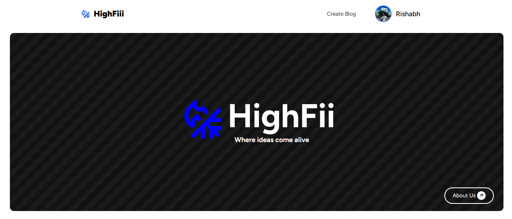

# HighFiii Blog App

Welcome to HighFiii, a blog app built using Vite React and Firebase for authentication and database management. HighFiii allows users to create and customize their profiles and publish blogs with titles, descriptions, images, and tags. 

## Latest Update

1. **Added a New Hero Section**: Introduced a new hero section to enhance user engagement and provide a more impactful introduction to the site.

2. **UI Upgrades**: Improved the user interface to provide a more modern and visually appealing experience.

3. **Enhanced Profile Update Method**: Implemented a more precise method for updating user profiles, ensuring a smoother and more reliable process.

4. **Integration of Cropper.js**: Utilized Cropper.js to enhance the usability and stability of the blog site, allowing users to crop images more efficiently.

5. **Built with Love ❤️**: Developed with care and attention to detail to provide a delightful experience for our users.

## Screenshots

_New hero section to increase user engagement._

_Updated UI for a more modern look._

_Updated Layout for a blog content._

## Features

- **User Authentication**: Secure authentication using Firebase Authentication.
- **Realtime Database**: Firebase Realtime Database is used to store and retrieve blog data.
- **Create Blogs**: Users can create blogs by providing a title, description, image, and tags.
- **Customize Profiles**: Users have the option to customize their profiles.

## Technologies Used

- **Vite**: A build tool that aims to provide a faster and more streamlined development experience for modern web projects.
- **React**: A JavaScript library for building user interfaces.
- **Firebase**: A platform developed by Google for creating mobile and web applications.

## Getting Started

To get started with HighFiii, follow these steps:

1. Clone the repository: `git clone https://github.com/Abhinav-Chauhan1/highfiii.git`
2. Navigate to the project directory: `cd highfiii`
3. Install dependencies: `npm install`
4. Configure Firebase:
   - Create a Firebase project at [Firebase Console](https://console.firebase.google.com/).
   - Enable Authentication and Realtime Database services.
   - Copy your Firebase config credentials and replace them in the project.
5. Run the app: `npm run dev`

## Deployment

HighFiii is hosted on Netlify at [highfiii.netlify.app](https://highfiii.netlify.app/). To deploy your own version, follow these steps:

1. Sign up for a Netlify account at [Netlify](https://www.netlify.com/).
2. Connect your GitHub repository to Netlify.
3. Configure your build settings.
4. Deploy the app.

## Contributing

Contributions are welcome! If you have any ideas for new features, improvements, or bug fixes, please open an issue or submit a pull request.

## License

This project is licensed under the MIT License - see the [LICENSE](LICENSE) file for details.

## Acknowledgements

- Built with [Vite](https://vitejs.dev/)
- Developed using [React](https://reactjs.org/)
- Powered by [Firebase](https://firebase.google.com/)
